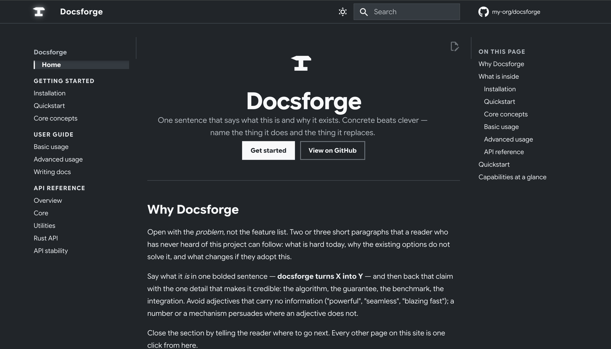

<div align="center">


# Docsforge


**A ready to use documentation setup for Python and Rust projects**. Docs template with a flat, high-contrast theme, an auto-generated API reference, and CI that publishes to GitHub Pages.

[](https://www.python.org)
[](https://www.rust-lang.org)
[](https://squidfunk.github.io/mkdocs-material/)
[](LICENSE)

</div>



## Use it

Prerequisites: [uv](https://docs.astral.sh/uv/) for the Python side, and a
[Rust toolchain](https://rustup.rs/) for the crate — the docs build invokes
`cargo` to generate the Rust API reference.

```bash
# 1. Start from this template (GitHub: "Use this template"), then clone it
git clone https://github.com/my-org/docsforge myproject
cd myproject

# 2. Rename everything — preview first, then apply
python scripts/init_template.py --dry-run
python scripts/init_template.py

# 3. Install and preview
uv sync --all-extras
uv run mkdocs serve            # http://127.0.0.1:8000/docsforge/
```

The init script is non-interactive too:

```bash
python scripts/init_template.py \
  --name "MyProject" --package myproject \
  --org my-org --repo myproject \
  --author "MyProject contributors" \
  --tagline "Differentiable widgets for people who hate widgets."
```

It rewrites the placeholders (`docsforge`, `my-org`, `my-org/docsforge`,
`Docsforge contributors`) across every text file, renames `src/docsforge/`,
stamps the license year, installs the starter README, and then deletes itself.

The root is deliberately bare: `README.md` and `LICENSE` are the only documents
there. Contribution, security, and support guidance belongs on the docs site (or
in GitHub's own Discussions and security-advisory features) rather than in a
drift-prone pile of markdown at the top level.

## What you get

| | |
|---|---|
| **Theme** | Material for MkDocs, flat squared-off styling, Google Sans Flex + Google Sans Code, one neutral nine-step palette driving both light and dark schemes, with a toggle |
| **Home page** | Spare hero — mark, name, one sentence, two links — over an auto-fitting feature-card grid |
| **Content** | Admonitions, collapsible details, synced content tabs, code annotations, math (MathJax + instant-nav hookup), footnotes, keyboard keys, task lists |
| **API reference** | mkdocstrings renders NumPy-style docstrings straight from `src/`, and an MkDocs hook folds rustdoc output for the crate in `rust/` into the site; nothing to keep in sync by hand |
| **Docs-as-code** | `--8<--` includes pull example scripts in from the repo, so snippets cannot drift |
| **Strict builds** | `validation:` in `mkdocs.yml` turns broken links, bad anchors, and pages missing from the nav into build failures |
| **CI** | `docs.yml` publishes to GitHub Pages; `ci.yml` runs lint, mypy, tests (3.11–3.13 × Linux/macOS/Windows), rustfmt/Clippy/`cargo test` for the crate, and the same strict docs build on every PR; `links.yml` checks external links weekly; `release.yml` publishes to PyPI on a tag, via trusted publishing |
| **Repo hygiene** | API-stability policy, issue/PR templates, CODEOWNERS, Dependabot, pre-commit, least-privilege workflow permissions — README and LICENSE are the only root docs |
| **Working example** | A tiny real package (`src/docsforge/`) and crate (`rust/`) with tested doctests, and example scripts the suite actually executes — so the whole pipeline is green from the first commit |

## Layout

```text
.
├── mkdocs.yml                  # theme, extensions, plugins, nav
├── docs/
│   ├── index.md                # home page + hero
│   ├── logo.svg                # placeholder mark (swap for yours)
│   ├── img/                    # figure placeholders (swap for real ones)
│   ├── stylesheets/extra.css   # the entire visual identity, `--site-*` vars
│   ├── javascripts/mathjax.js  # math, wired to instant navigation
│   ├── getting-started/        # installation · quickstart · concepts
│   ├── guide/                  # basic · advanced · writing-docs (style guide)
│   └── reference/              # generated API reference + stability policy
├── src/docsforge/              # example package the API reference renders
├── rust/                       # example crate; rustdoc renders its API reference
├── examples/basic_usage.py     # included verbatim into the docs, run by the tests
├── conftest.py                 # fixtures shared by tests/ and the src/ doctests
├── tests/                      # proves the CI pipeline works end to end
├── scripts/                    # the renamer, the rustdoc hook, the starter README
└── .github/                    # workflows, issue/PR templates, CODEOWNERS, Dependabot
```

## Publishing to GitHub Pages

One-time setup after your first push: **Settings → Pages → Build and deployment
→ Source: GitHub Actions**. From then on, `.github/workflows/docs.yml` builds
and deploys on every push to `main` that touches `docs/`, `mkdocs.yml`, `src/`,
`rust/`, or `examples/`.

For a project site the default `site_url` is
`https://<org>.github.io/<repo>/`; the init script sets it for you.

## Publishing to PyPI

`.github/workflows/release.yml` builds and uploads on any `v*` tag, using
[trusted publishing](https://docs.pypi.org/trusted-publishers/) — no API token
in your repository secrets. Two one-time steps before the first tag:

1. On PyPI, **Your projects → Publishing → Add a pending publisher**: owner
   `<org>`, repository `<repo>`, workflow `release.yml`, environment `pypi`.
2. On GitHub, **Settings → Environments → New environment → `pypi`**. Add
   required reviewers here if you want a human in the loop.

The workflow refuses to publish when the tag disagrees with `__version__` in
`src/docsforge/__init__.py`, which is the single source of the version —
`pyproject.toml` reads it via `[tool.hatch.version]`.

## Customizing

**Colors.** The whole site is driven by one nine-step neutral ramp declared as
`--site-c-*` variables at the top of `docs/stylesheets/extra.css` — Bright Snow
`#f8f9fa` through Carbon Black `#212529`. Both schemes, every Material variable,
and the hero read from it, so swapping those nine values rebrands the site.
`theme.palette` in `mkdocs.yml` is set to `custom` precisely so Material's own
color rules stay out of the way.

**Logo.** Replace `docs/logo.svg`. Keep it single-color and near-white: the
header is Carbon Black in both schemes, and the hero inverts the mark in the
light scheme rather than carrying a second asset. Mind the stroke weight —
strokes thinner than roughly `12` units on a `1024` viewBox disappear at the
72px the hero renders it at.

**Fonts.** `theme.font` in `mkdocs.yml` — Google Sans Flex for text, Google Sans
Code for code. The CSS reads Material's `--md-text-font-family` and
`--md-code-font-family`, so changing those two lines is enough. Note that Google
Sans Flex ships no italic faces; browsers synthesize the oblique.

**Not a Python project?** Delete the `mkdocstrings` block from `mkdocs.yml`,
drop `docs/reference/core.md`, `docs/reference/utils.md`, `src/`, `tests/`,
`conftest.py`, and `examples/*.py`, and remove the `test`, `typecheck`, and
`lint` jobs from `ci.yml` plus `release.yml`. Everything else is
language-agnostic — you will still need `uv` (or plain `pip`) for MkDocs itself.

**Not a Rust project?** Delete `rust/`, `scripts/rustdoc_hook.py` (plus the
`hooks:` block in `mkdocs.yml`), `docs/reference/rust.md` (plus its `nav:`
entry and the card in `docs/reference/index.md`), the `rust` job in `ci.yml`,
the Rust toolchain steps in `ci.yml` and `docs.yml`, the `cargo fmt` hook in
`.pre-commit-config.yaml`, the `cargo` entry in `.github/dependabot.yml`, the
`rust` badge above, and the `rust/target/` and `rust/Cargo.lock` lines in
`.gitignore`.

**Adding pages.** Create the `.md` file, add it to `nav:` in `mkdocs.yml`, link
to it with a relative `.md` path. `mkdocs build --strict` catches all three if
you miss one.

## Conventions

The [Writing docs](docs/guide/writing-docs.md) page is both the house style
guide and a live gallery of every component, with source shown next to the
rendered result. It is the one page worth reading before writing any others —
and worth keeping in your project so contributors have the same reference.

## License

[MIT](LICENSE) — use it for anything, no attribution required.
