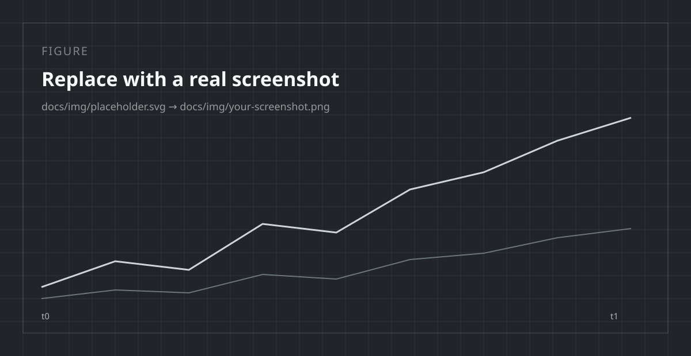

# Writing docs

Everything this template can render, with the source next to the result. Keep
this page in your project — it doubles as the house style guide and as a
component gallery you can copy from.

## Page anatomy

Every page follows the same skeleton:

1. **An `#` H1** matching the nav title.
2. **One or two orienting sentences** — what this page answers, and who for.
3. **`##` sections** that each answer a single question.
4. **A "where to next"** pointer at the end of long pages.

Front matter is optional. The only one used here hides the table of contents on
the home page:

```yaml
---
hide:
  - toc      # also available: navigation, footer
---
```

## Admonitions

Five types cover almost everything. Use them sparingly — a page of admonitions
is a page with no emphasis at all.

!!! note "Note — context the reader can skip"
    Background that helps but is not required to succeed.

!!! tip "Tip — a better way to do it"
    A shortcut, an idiom, or a habit worth forming.

!!! warning "Warning — you will probably get this wrong"
    Behavior that surprises people, especially silent-but-wrong behavior.

!!! danger "Danger — this destroys or corrupts something"
    Reserve for data loss, irreversible actions, and security footguns.

!!! example "Example"
    A worked case, when it is too long to sit inline.

```markdown
!!! warning "Warning — you will probably get this wrong"
    Behavior that surprises people, especially silent-but-wrong behavior.
```

### Collapsible variants

Use `???` for anything long enough to interrupt the reading flow — FAQs,
troubleshooting, proofs. Add `???+` to have it start open.

??? question "How do I make one collapsible?"

    Swap `!!!` for `???`. Everything else is identical.

    ```markdown
    ??? question "How do I make one collapsible?"
        Swap `!!!` for `???`.
    ```

## Content tabs

Tabs with the same labels stay in sync across the whole site, so a reader who
picks "uv" once sees "uv" everywhere.

=== "uv"

    ```bash
    uv add docsforge
    ```

=== "pip"

    ```bash
    pip install docsforge
    ```

````markdown
=== "uv"

    ```bash
    uv add docsforge
    ```

=== "pip"

    ```bash
    pip install docsforge
    ```
````

## Code blocks

### Annotations

Numbered annotations keep explanation next to the line it explains, without
cluttering the snippet:

```python
report = mp.summarize(values, trim=0.1)  # (1)!
print(report.to_row())  # (2)!
```

1.  Trimming sorts the input, so this is the branch that costs $O(n \log n)$.
2.  `to_row()` returns a plain dict — safe to hand to `json.dumps` or pandas.

````markdown
```python
report = mp.summarize(values, trim=0.1)   # (1)!
```

1.  The annotation body. Note the `!` after the number in the comment.
````

### Highlighting and titles

```python title="examples/basic_usage.py" hl_lines="3 4"
import docsforge as mp

values = [3.0, 1.0, 4.0, 1.0, 5.0]
report = mp.summarize(values, label="demo")

print(report.mean)
```

````markdown
```python title="examples/basic_usage.py" hl_lines="3 4"
```
````

### Including files

Never paste code you also maintain elsewhere. Include it instead — the file is
linted and tested in CI, so the docs cannot drift:

````markdown
```python
--8<-- "examples/basic_usage.py"
```
````

Includes resolve against the repo root and `docs/` (`base_path` in
`mkdocs.yml`), and `check_paths: true` turns a missing file into a build
failure rather than a silently empty block.

## Tables

| Option | Default | Notes |
|---|---|---|
| `trim` | `0.0` | Fraction dropped per tail |
| `precision` | `6` | Decimal places in reported figures |

Keep tables narrow. Three or four columns read well on a phone; seven do not.

## Math

Inline math uses `\(...\)` and display math uses `$$...$$`:

$$
\bar{x} = \frac{1}{n} \sum_{i=1}^{n} x_i
$$

so the trimmed variant drops \(k = \lfloor \alpha n \rfloor\) values per tail.

MathJax is wired to Material's instant navigation in
`docs/javascripts/mathjax.js`; without that hookup, formulas stop rendering
after the first in-page navigation.

## Figures

<figure markdown>
  { width="640" }
  <figcaption>Captions carry the finding; the image only illustrates it.</figcaption>
</figure>

```markdown
<figure markdown>
  { width="640" }
  <figcaption>What the reader should take away.</figcaption>
</figure>
```

Always write real alt text. "Screenshot" is not alt text.

## Feature grids

The card grid on the home page is plain HTML plus two classes:

```html
<div class="site-grid" markdown>

<div class="site-card" markdown>
### [Page title](../reference/index.md)
One line on why a reader would click this.
</div>

</div>
```

The `markdown` attribute is what lets Markdown work inside the HTML block; drop
it and your links render as literal text.

## Linking

| Target | Write |
|---|---|
| Another page | `[Quickstart](../getting-started/quickstart.md)` |
| A section | `[Sharp edges](advanced.md#sharp-edges)` |
| A Python object | ``[`Report`][docsforge.core.Report]`` |

Link to **`.md` files, not URLs** — MkDocs rewrites them and, under `--strict`,
fails the build when the target moves. The `validation:` block in `mkdocs.yml`
extends the same treatment to anchors and absolute links.

Cross-references like [`Report`][docsforge.core.Report] and
[`summarize()`][docsforge.core.summarize] are resolved by mkdocstrings, so they
follow the code when it is renamed.

## Smaller ingredients

Keyboard keys: press ++ctrl+alt+del++ (`++ctrl+alt+del++`).

Abbreviations get a tooltip on hover: the HTML is rendered by MkDocs.

*[HTML]: HyperText Markup Language

Footnotes carry the aside that would otherwise break a sentence in half.[^1]

[^1]: Like this one. They collect at the bottom of the page automatically.

Task lists track work in-page:

- [x] Written
- [ ] Reviewed

## House style

- **Second person, present tense.** "Pass `trim=0.1`", not "one may pass".
- **Lead with the answer.** The first sentence of a section answers its heading;
  the rest justifies it.
- **Show the smallest runnable thing.** Every snippet should execute as written.
- **No adjectives doing the work of evidence.** Replace "very fast" with a
  number or delete it.
- **One idea per section.** If a section needs an "also", it is two sections.
- **Wrap prose at ~80 columns.** Diffs stay readable and reviewable.

## Before you push

- [ ] `uv run mkdocs build --strict` passes (this is what CI runs)
- [ ] New pages are added to `nav:` in `mkdocs.yml`
- [ ] Links use relative `.md` paths
- [ ] Snippets run as written
- [ ] Images have meaningful alt text
